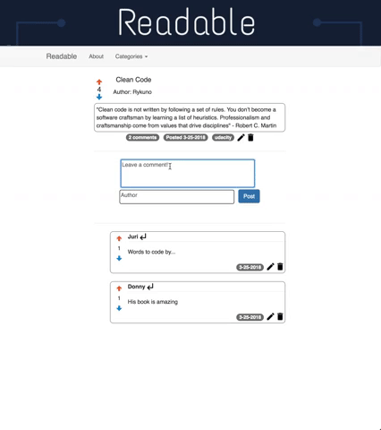

# Readable

## Description
This project was built for Udacity's Redux course where where this project's goal is to build a content and comment web app. Users can post content to predefined categories, comment on their posts and other users' posts, and vote on posts and comments. Users will also be able to edit and delete posts and comments.

## Installation
Download 

